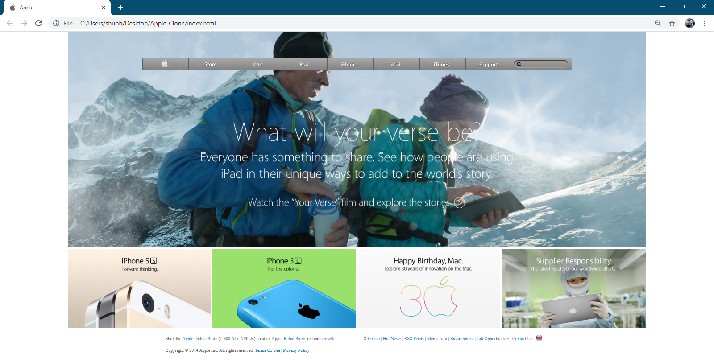

# Apple Clone -Building with Backgrounds and Gradients

> A clone of 2014 Apple website written in HTML, using CSS for styling..

Additional description about the project and its features.

## Built With

- HTML
- CSS

## Getting Started

Creating an replica for old Apple home page of year 2014.
Link can be found below:
https://web.archive.org/web/20140301004610/http://www.apple.com/

To get a local copy up and running follow these simple example steps.

git clone https://github.com/shubham14p3/Apple-Clone.git

## Authors

👤 **Shubham Raj**

- Github: [@shubham14p3](https://github.com/shubham14p3)
- Linkedin: [shubham14p3](https://linkedin.com/shubham14p3)

## 🤝 Contributing

Contributions, issues and feature requests are welcome!

Feel free to check the [issues page](/https://github.com/shubham14p3/Apple-Clone.git/issues/).

## Show your support

Give a ⭐️ if you like this project!

## 📝 License

This project is [MIT](lic.url) licensed.
